# PostgreSQL Database Schema & Entity-Relationship Diagram

## 1. Entity-Relationship Diagram (ERD)

```mermaid
erDiagram
    accounts_user ||--o{ leaves_leave_request : "submits"
    accounts_user ||--o{ leaves_leave_request : "reviews"
    accounts_user ||--o{ accounts_user : "manages"
    accounts_user ||--o{ leaves_leave_balance : "owns"
    leaves_leave_type ||--o{ leaves_leave_request : "categorises"
    leaves_leave_type ||--o{ leaves_leave_balance : "defines"

    accounts_user {
        bigint id PK
        string username UK
        string email UK
        string password
        string first_name
        string last_name
        string role "EMPLOYEE | MANAGER | ADMIN"
        string employee_id UK
        string department
        string phone_number
        string profile_picture
        bigint manager_id FK
        date date_of_joining
        boolean is_active
        boolean is_staff
        boolean is_superuser
        timestamp date_joined
    }

    leaves_leave_type {
        bigint id PK
        string name UK
        text description
        integer max_days_per_year
        boolean requires_approval
        boolean is_paid
        boolean is_active
        timestamp created_at
        timestamp updated_at
    }

    leaves_leave_request {
        bigint id PK
        bigint employee_id FK
        bigint leave_type_id FK "Nullable"
        date start_date
        date end_date
        integer total_days
        text reason
        string status "PENDING | APPROVED | REJECTED | CANCELLED"
        bigint reviewed_by_id FK "Nullable"
        text reviewer_comment
        timestamp reviewed_at "Nullable"
        timestamp created_at
        timestamp updated_at
    }

    leaves_leave_balance {
        bigint id PK
        bigint employee_id FK
        bigint leave_type_id FK
        integer year
        decimal allocated_days
        decimal used_days
        decimal remaining_days
    }
```

---

## 2. Table Schemas & Constraints

### 1. `accounts_user` Table
Stores custom user accounts with role-based access control.

| Column | Type | Constraints | Description |
|---|---|---|---|
| `id` | `BIGINT` | `PRIMARY KEY`, `AUTO_INCREMENT` | Unique user identifier |
| `username` | `VARCHAR(150)` | `UNIQUE`, `NOT NULL` | Account username |
| `email` | `VARCHAR(254)` | `UNIQUE`, `NOT NULL` | User email address |
| `password` | `VARCHAR(128)` | `NOT NULL` | Hashed password string |
| `first_name` | `VARCHAR(150)` | `NOT NULL` | First name |
| `last_name` | `VARCHAR(150)` | `NOT NULL` | Last name |
| `role` | `VARCHAR(20)` | `NOT NULL`, `DEFAULT 'EMPLOYEE'` | Role (`EMPLOYEE`, `MANAGER`, `ADMIN`) |
| `employee_id` | `VARCHAR(50)` | `UNIQUE`, `NULLABLE` | Corporate employee ID |
| `department` | `VARCHAR(100)` | `BLANK=TRUE` | Department name |
| `phone_number` | `VARCHAR(20)` | `BLANK=TRUE` | Contact phone number |
| `profile_picture` | `VARCHAR(100)` | `NULLABLE` | Image filepath |
| `manager_id` | `BIGINT` | `FOREIGN KEY (accounts_user.id)` | Direct manager FK |
| `date_of_joining` | `DATE` | `NULLABLE` | Joining date |
| `is_active` | `BOOLEAN` | `NOT NULL`, `DEFAULT TRUE` | Account active flag |
| `is_staff` | `BOOLEAN` | `NOT NULL`, `DEFAULT FALSE` | Admin panel access |
| `is_superuser` | `BOOLEAN` | `NOT NULL`, `DEFAULT FALSE` | Superuser flag |
| `date_joined` | `TIMESTAMPTZ` | `NOT NULL` | Registration timestamp |

---

### 2. `leaves_leave_request` Table
Stores leave applications submitted by employees.

| Column | Type | Constraints | Description |
|---|---|---|---|
| `id` | `BIGINT` | `PRIMARY KEY`, `AUTO_INCREMENT` | Request identifier |
| `employee_id` | `BIGINT` | `FOREIGN KEY (accounts_user.id)`, `CASCADE` | Submitting employee |
| `leave_type_id` | `BIGINT` | `FOREIGN KEY (leaves_leave_type.id)`, `NULLABLE` | Leave type definition |
| `start_date` | `DATE` | `NOT NULL` | First day of leave |
| `end_date` | `DATE` | `NOT NULL` | Last day of leave |
| `total_days` | `INTEGER` | `NOT NULL`, `DEFAULT 0` | Total inclusive days |
| `reason` | `TEXT` | `BLANK=TRUE` | Employee's reason |
| `status` | `VARCHAR(20)` | `NOT NULL`, `DEFAULT 'PENDING'` | Status (`PENDING`, `APPROVED`, `REJECTED`, `CANCELLED`) |
| `reviewed_by_id` | `BIGINT` | `FOREIGN KEY (accounts_user.id)`, `NULLABLE` | Manager who reviewed |
| `reviewer_comment` | `TEXT` | `BLANK=TRUE` | Manager note/comment |
| `reviewed_at` | `TIMESTAMPTZ` | `NULLABLE` | Timestamp of approval/rejection |
| `created_at` | `TIMESTAMPTZ` | `NOT NULL`, `AUTO_NOW_ADD` | Application timestamp |
| `updated_at` | `TIMESTAMPTZ` | `NOT NULL`, `AUTO_NOW` | Last modified timestamp |

---

### 3. Database Indexes

| Index Name | Table | Columns | Purpose |
|---|---|---|---|
| `accounts_user_email_idx` | `accounts_user` | `email` | Fast user login lookups |
| `accounts_user_employee_id_idx` | `accounts_user` | `employee_id` | Fast employee ID lookups |
| `accounts_user_role_idx` | `accounts_user` | `role` | Role-based filtering |
| `leaves_leave_request_status_idx` | `leaves_leave_request` | `status` | Filter leaves by status |
| `leaves_leave_request_emp_status_idx` | `leaves_leave_request` | `employee_id`, `status` | Fast employee history lookups |
| `leaves_leave_request_date_idx` | `leaves_leave_request` | `start_date`, `end_date` | Date range filtering & overlap checks |
